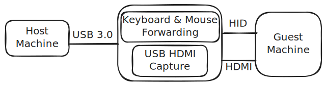
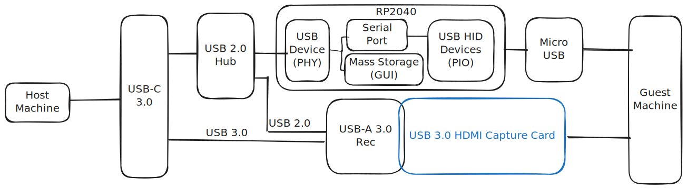

# Under Construction Warning
This documentation is incomplete but I'm fast losing motivation for this project but I wanted to at least get it out there since I put in all this work. For anybody venturing a reproduction of this, very limited testing has been done so almost certainly something will not work or will need better documentation but should be pretty quick to resolve. 
# Project Overview
This USB KVM (keyboard video mouse) integrates off the shelf USB capture cards with a custom pcb to enable direct control of an otherwise headless computer though a host PC.  This is a hobby project more than anything though, it does feel like a thing that should already exist.  In fact, there are similar designs that have started popping up on my radar while working on this - [see below](#Similar%20Projects). 

The board uses two RP2040s to forward inputs from the host to the guest machine (some work was done to enable the PIO based USB but it was not robust enough and had a regression in V0.6 which really messed things up).  The RP2040 also implements a read only host side USB mass storage device which holds an SDL3 based GUI executable - everything in one package except the SDL library which is dynamically linked (if I did it right).   
## Similar Projects
- While working on this I found some similar projects pop up:
    - https://github.com/carrotIndustries/usbkvm
    - https://openterface.com/
## License
- Firmware and GUI Code: MIT
- Hardware and Case: CERN Open Hardware Licence Version 2 - Permissive
# Hardware Design
The electrical design consists of two RP2040, and several connectors.  It relies on how USB3.0 is a wholly separate communication path etc. to avoid needed a hub.  So only the USB 3.0 high speed signals are connected to the capture card.  This works with the cards I've tried but I'm not sure it would work in all cases.  It uses primarily 0402 components for space saving.  Designed with kicad.

There is also a pretty basic enclosure design made with freecad.  

## BOM
Costs based on market costs circa Q1 2025.

| Part                        | Quantity | Cost cnt 1 | Link                                                              | Notes                                                                                                                                                                                          |
| --------------------------- | -------- | ---------- | ----------------------------------------------------------------- | ---------------------------------------------------------------------------------------------------------------------------------------------------------------------------------------------- |
| 100n                        | 11       |            |                                                                   | 0402                                                                                                                                                                                           |
| 1u                          | 7        |            |                                                                   | 0402                                                                                                                                                                                           |
| 15p                         | 2        |            |                                                                   | 0402                                                                                                                                                                                           |
| 5.1k                        | 3        |            |                                                                   | 0402                                                                                                                                                                                           |
| 10k                         | 2        |            |                                                                   | 0402                                                                                                                                                                                           |
| 27.4                        | 4        |            |                                                                   | 0402                                                                                                                                                                                           |
| 1k                          | 1        |            |                                                                   | 0402                                                                                                                                                                                           |
| 1.5k                        | 1        |            |                                                                   | 0402                                                                                                                                                                                           |
| RP2040                      | 2        | $0.80      | [Link](https://mou.sr/3LW0tBj)                                    |                                                                                                                                                                                                |
| W25Q16JVSSIQ                | 2        | $0.41      | [Link](https://www.mouser.com/ProductDetail/454-W25Q16JVSSIQ)     | Other Values in the family will probably work.  Currently something around 1-2MB is all that's needed.                                                                                         |
| MIC5504-3.3YM5              | 1        | $0.16      | [Link](https://www.mouser.com/ProductDetail/998-MIC5504-3.3YM5TR) |                                                                                                                                                                                                |
| ABM8-272-T3                 | 1        | $0.58      | [Link](https://www.mouser.com/ProductDetail/815-ABM8-272-T3)      |                                                                                                                                                                                                |
| USB4056-03-A                | 1        | $0.97      | [Link](https://www.mouser.com/ProductDetail/640-USB4056-03-A)     | USB C Connector                                                                                                                                                                                |
| 10118192-0001LF             | 1        | $0.41      | [Link](https://www.mouser.com/ProductDetail/649-10118192-0001LF)  | Micro USB                                                                                                                                                                                      |
| USB-A3-S-RA                 | 1        | $0.62      | [Link](https://www.mouser.com/ProductDetail/737-USB-A3-S-RA)      | Type A Connector                                                                                                                                                                               |
| PCB                         | 1        | $3.33      | [Link](https://oshpark.com/)                                      | $10 for 3.                                                                                                                                                                                     |
| HDMI to USB 3.0 with MS2130 | 1        | $7         | Search  Aliexpress                                                | Capture card anything with the MS2130 is likely to work (also non- MS2130 based capcure cards *should* work as long as they are USB3.0) I like this one from Amazon: https://a.co/d/gPflUW0 |
| TOTAL                       |          | $15.5      |                                                                   | $8.5 Without the capture card                                                                                                                                                                  |

# Software Design
Some disclaimers. A goal of this project was to use Zig for embeded work.  I'm sure some of the architectural decisions are not ideal because of that.  
## Build Flow
TODO
## Host Firmware
The host firmware handles the clock and reset pins of the guest.  It also presents as a Serial port for debug communication and pass-through of HID commands. There is a shared commands module used by all three executable to enable single source standardized messages.  For more details ask and/or see source code.
The mass storage data image is generated using *mkfs.fat* and *mcopy* commands then converting that binary into a C source file.  

## Guest Firmware
The Guest FW receives HID commands and forwards them to the guest machine.  It presents a keyboard and mouse.  The mouse is relative for now - though I've explored doing an abs mouse.  For more details ask and/or see source code.
## GUI 
The GUI uses SDL3 to present the video frames and handle input events.  It supports *typing* copied text from the host to the guest with the insert key (so insert is not forwarded).  There are other limitations in what is forwarding based on the OS's restrictions I think. 
### Compatibility
I've only really tested this on my setup so I've no clue how well it might work in any other setup.  I have tried to use cross platform, adaptable libraries so I'm hoping it's not too much work to enable elsewhere.  I think it's pretty close to be working on windows if I could figure out cross compile. 

# Next steps (in no order):
- Audio support in GUI (work around is to use OS audio controls)
- Bug fixes and compatibility improvements
- Nothing supports having multiples connected a the same time (though not sure the use case is relevant the case should be handled somehow). 
- Support Controller Events (I'm not sure how to enabled another interface in tinyUSB)
- GUI based controls
    - Support special keys & key combinations (in UI)
- Windows support
- Simplify launching GUI (currently requires coping the binary out of the storage and making it executable see readme)
- FAT12 build process feels like a hack.
- Zig packed structs (learned about them too late)
## Future HW Ideas
- Integrate the MS2130 into the design directly
    - If I find a source, I'll likely try this.
- Could we input VGA into the RP2040 and output USB UVC device - it would be slow and/or low resolution but might be interesting?
- Revisit PIO based USB to guest (last time it was not mature enough)
- Reduce the number of EEPROMs by having one RP2040 load the other one. 
# Making your own

## Hardware
See BOM.

- Beyond the BOM, I used large size shrink wrap to cover the hdmi capture card (after removing it's case).
- Also bought a stencil from Oshpark stencils for assembly. 
## Assembly notes
- USB C hand assemblies doesn't work well (I'll try to add some pictures).
    - Had to break off the back tab to touch it up.
    - Also need to make sure there is good contact with the small through hole pins of the connector. 
- Hand held DMM verification of USB connections 
- Capture card prep
    - Probably need to remove case. 
## Software 
- Use the released version - just drag it to the RP2040 when it shows up in boot mode.
- Alliteratively build it yourself:
### Building FW
TODO this section

The Icon comes from: [Remote desktop icons created by Freepik - Flaticon](https://www.flaticon.com/free-icons/remote-desktop)
