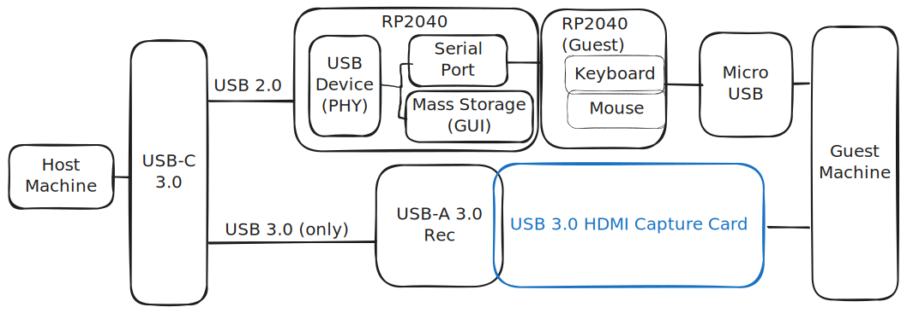

# Under Construction Warning
This documentation is incomplete but I'm fast losing motivation for this project but I wanted to at least get it out there since I put in all this work. For anybody venturing a reproduction of this, very limited testing has been done so almost certainly something will not work or will need better documentation. 
# Project Overview
This USB KVM (keyboard video mouse) integrates off the shelf USB capture cards with a custom designed pcb to enable direct control of an otherwise headless computer though a host PC.  This is a hobby project more than anything though, it does feel like a thing that should already exist.

And in fact, there are similar designs that have started popping up on my radar while working on this - [see below](#Similar%20Projects). 
The board uses a RP2040 to forward inputs from the host to the guest machine - utilizing the [USB-PIO features ](https://github.com/sekigon-gonnoc/Pico-PIO-USB)of the RP2040 to enable two usb device ports connecting to two separate machines from a single chip.  The RP2040 also implements a read only host side USB mass storage device which has the GUI (python). 
## Similar Projects
- While working on this I found some similar projects:
    - https://github.com/carrotIndustries/usbkvm
    - https://openterface.com/

# Hardware Design
The electrical design consists of a RP2040, the USB Type A port and a USB 2.0 hub to connect them. It was designed with kicad.
TODO: picture of assembled PCB
There is also a pretty basic enclosure design made with freecad.  
TODO: picture with enclosure

## BOM
Costs based on market costs circa Q3 2024.

| Part                        | Quantity | Cost cnt 1 | Link                                                                          | Notes                                                                                                                                                 |
| --------------------------- | -------- | ---------- | ----------------------------------------------------------------------------- | ----------------------------------------------------------------------------------------------------------------------------------------------------- |
| 100n                        | 7        |            |                                                                               | 0402                                                                                                                                                  |
| 1u                          | 4        |            |                                                                               | 0402                                                                                                                                                  |
| 10u                         | 4        |            |                                                                               | 0402                                                                                                                                                  |
| 15p                         | 2        |            |                                                                               | 0402                                                                                                                                                  |
| 5.1k                        | 2        |            |                                                                               | 0402                                                                                                                                                  |
| 20k                         | 2        |            |                                                                               | 0402                                                                                                                                                  |
| 27.4                        | 2        |            |                                                                               | 0402                                                                                                                                                  |
| 100                         | 2        |            |                                                                               | 0402                                                                                                                                                  |
| 22                          | 2        |            |                                                                               | 0402                                                                                                                                                  |
| 1k                          | 1        |            |                                                                               | 0402                                                                                                                                                  |
| 10k                         | 1        |            |                                                                               | 0402                                                                                                                                                  |
| 1.5k                        | 1        |            |                                                                               | 0402                                                                                                                                                  |
| RP2040                      | 1        | $0.80      | [Link](https://mou.sr/3LW0tBj)                                                |                                                                                                                                                       |
| W25Q16JVSSIQ                | 1        | $0.41      | [Link](https://www.mouser.com/ProductDetail/454-W25Q16JVSSIQ)                 | Other Values in the family will probably work.  Currently something around 1MB is all that's required (maybe less I'm not sure what to check yet).    |
| MIC5504-3.3YM5              | 1        | $0.16      | [Link](https://www.mouser.com/ProductDetail/998-MIC5504-3.3YM5TR)             |                                                                                                                                                       |
| SL2.1A                      | 1        | $0.24      | [Link](https://www.lcsc.com/product-detail/USB_CoreChips-SL2-1A_C192893.html) | LCSC Supplier                                                                                                                                         |
| ABM8-272-T3                 | 1        | $0.58      | [Link](https://www.mouser.com/ProductDetail/815-ABM8-272-T3)                  |                                                                                                                                                       |
| USB4056-03-A                | 1        | $0.97      | [Link](https://www.mouser.com/ProductDetail/640-USB4056-03-A)                 | USB C Connector                                                                                                                                       |
| 10118192-0001LF             | 1        | $0.41      | [Link](https://www.mouser.com/ProductDetail/649-10118192-0001LF)              | Micro USB                                                                                                                                             |
| USB-A3-S-RA                 | 1        | $0.62      | [Link](https://www.mouser.com/ProductDetail/737-USB-A3-S-RA)                  | Type A Connector                                                                                                                                      |
| PCB                         | 1        | $3.33      | [Link](https://oshpark.com/)                                                  | $10 for 3.  Need to look into sharing the project on OSHPark                                                                                          |
| HDMI to USB 3.0 with MS2130 | 1        | $7         | Search  Aliexpress                                                            | Capture card anything with the MS2130 is likely to work (also non- MS2130 based *should* work) I like this one from Amazon: https://a.co/d/gPflUW0 |
| TOTAL                       |          | $15        |                                                                               | $8 Without the capture card                                                                                                                           |

# Software Design
TODO: Fill in this outline
## RP2040 FW
- I am not a great with SW dev so there are, I'm sure issues in the code. 
- There is a bug I could not figure out that made the PIO based USB break when I tried to use GPIO 4 as a pull up for the positive USB pin. 
- HID forwarding system
- Mass Storage Device
### Dependencies
- PIO USB 6.1
- PICO SDK 2.0
- TinyUSB (part of pico-sdk 2.0)

## Python GUI 

### Compatibility
I've only really tested this on my setup so I've no clue how well it might work in any other setup.  I have tried to use cross platform, adaptable libraries so I'm hoping it's not too much work to enable elsewhere. 

# Next steps (in no order):
- Audio support in GUI (work around is to use OS audio controls)
- Bug fixes and compatibility improvements
- Nothing supports having multiples connected a the same time (though not sure the use case is relevant the case should be handled somehow). 
- Support Controller Inputs
- Reduce python dependencies - maybe package what I can if it will fit?
    - Or Migrate to different GUI framework & language with small bin side (fits in the RP2040 Flash) and cross platform support.
    - SDL2 has support for other languages so should be pretty close. 
- Support special keys & key combinations (in UI)
- Windows support - should be close but I think it will break right now because discovery & configuration is V4L2 based.
## Future Ideas
- Integrate the MS2130 into the design directly
    - If I find a source, I'll likely try this.
- Could we input VGA into the RP2040 and output USB UVC device - it would be slow and/or low resolution but might be interesting? 
- Could remove the HUB IC and only support USB 3.0 to simplify the design even more (I think that could work from what I can tell 3.x is completely separate from USB 2.0)
# Making your own

## Hardware
See BOM.

- Beyond the BOM, I used large size shrink wrap to cover the hdmi capture card (after removing it's case).
- Also bought a stencil from Oshpark stencils for assembly. 
## Assembly notes
- USB C hand assemblies doesn't work well (I'll try to add some pictures).
    - Had to break off the back tab to touch it up.
    - Also need to make sure there is good contact with the small through hole pins of the connector. 
- Hand held DMM verification of USB connections 
- Capture card prep
    - Probably need to remove case. 

## Software 
- Use the released version - just drag it to the RP2040 when it shows up in boot mode.
- Alliteratively build it yourself:
### Building FW
TODO this section

### GUI 
The python based GUI code comes with the RP2040 FW.  It does, however have several dependencies listed out in requirements.txt .  They are all available with a pip install and can alternatively be installed through whatever other means.  Usage is pretty standard so it's unlikely newer version will break compatibility.  